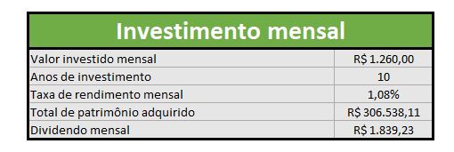
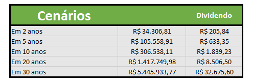
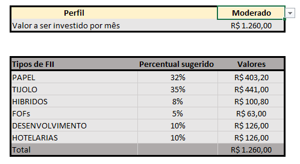

# Controle_de_Investimentos_Excel
Projeto feito na DIO em parceria com Trainee Santander

Este projeto consiste em uma planilha em Excel com o tema de **simulação e controle de investimento imobiliário**, permitindo que o usuário visualize cenários de crescimento patrimonial e dividendos ao logo do tempo.

## Tabela Configurações:
Permite que o usuário informe seu salário e visualize uma **sugestão de investimento mensal** baseada nesse valor.

  

## Tabela Investimento Mensal
Exibe o **patrimônio acumulado** e o **dividendo mensal estimado**, considerando:
- Taxa de rendimento mensal  
- Tempo de investimento (anos)  
- Valor investido mensalmente  

  

## Tabela Cenários 
Apresenta múltiplos **cenários de investimento de 2 a 30 anos**, em que permite comparar a evolução do patrimônio e dos dividendos ao longo do tempo.

  

## Tabela de tipo de investimento e perfil

Mostra a **distribuição percentual sugerida** entre diferentes tipos de fundos imobiliários.  
Além disso, a tabela de perfil permite simular resultados para perfis:
- Conservador  
- Moderado  
- Agressivo

  

